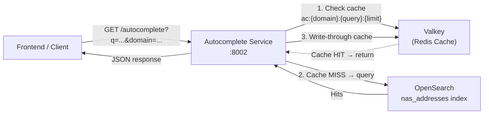
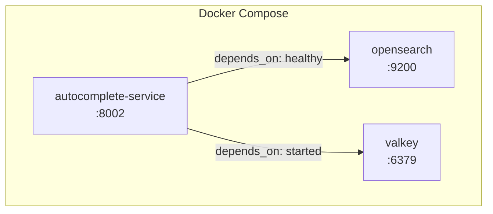

# Design Document: Autocomplete Service

## Overview

The Autocomplete Service is a standalone, read-only FastAPI microservice that provides fast address-prefix suggestions for the NAS platform. It sits between the frontend and OpenSearch, with a Redis (Valkey) cache layer to minimize latency for repeated queries.

**Design rationale:** The service is intentionally decoupled from the main NAS backend (PostgreSQL, auth, ETL) to keep its dependency graph minimal — only OpenSearch for search and Valkey for caching. This isolation means it can scale independently and restart without affecting the ingestion pipeline.

**Key decisions:**
- **No authentication** — the autocomplete endpoint is public since suggestions are non-sensitive reference data.
- **Domain-based routing** — a single endpoint serves multiple index types via the `domain` parameter, avoiding endpoint proliferation as new autocomplete sources are added.
- **Dual query strategy** — `bool_prefix` (multi_match on `search_as_you_type` sub-fields) for the existing `nas_addresses` index; `match_phrase_prefix` for simpler future indices with a plain `value` field.
- **Best-effort caching** — Redis failures never block or error responses; the service degrades gracefully to direct OpenSearch queries.

## Architecture



### Request Flow

1. Client sends `GET /autocomplete?q=jalan&domain=address&limit=10`
2. Service normalizes query (trim + lowercase), constructs cache key
3. Attempts Redis GET — on hit, returns cached suggestions immediately
4. On cache miss, builds OpenSearch query payload based on domain config
5. Sends query to OpenSearch, extracts result field values from hits
6. Writes suggestions to Redis with TTL (best-effort, fire-and-forget on error)
7. Returns `{"suggestions": [...]}` to client

### Deployment Topology



The service is deployed as a Docker container within the existing NAS Docker Compose stack, using `python:3.12-slim` as base image with `uvicorn` as the ASGI server.

## Components and Interfaces

### Module Structure

```
autocomplete-service/
├── app.py          # FastAPI application, endpoint handlers, lifespan management
├── config.py       # Settings class (env vars) + DOMAIN_CONFIG registry
├── search.py       # OpenSearch query builder and executor
├── cache.py        # Redis GET/SET helpers (best-effort, exception-safe)
├── Dockerfile      # python:3.12-slim, EXPOSE 8002
└── requirements.txt
```

### app.py — Application Layer

| Symbol | Responsibility |
|--------|---------------|
| `lifespan()` | Creates shared Redis connection on startup, closes on shutdown |
| `health()` | `GET /health` → `{"status": "ok", "service": "autocomplete-service"}` |
| `autocomplete()` | `GET /autocomplete` — validates input, orchestrates cache → search → cache-write flow |
| `ServiceError` | Custom exception with HTTP status code mapping |

### config.py — Configuration

| Symbol | Responsibility |
|--------|---------------|
| `Settings` | Reads `OPENSEARCH_URL`, `REDIS_URL`, `HOST`, `PORT`, `CACHE_TTL_SECONDS` from env with defaults |
| `DOMAIN_CONFIG` | Static dict mapping domain names → `{index, query_type, query_fields, result_field}` |

**DOMAIN_CONFIG schema:**

```python
{
    "address": {
        "index": "nas_addresses",
        "query_type": "bool_prefix",
        "query_fields": ["autocomplete", "autocomplete._2gram", "autocomplete._3gram"],
        "result_field": "address_clean",
    },
    # Future: "complaint", "street", etc.
}
```

### search.py — OpenSearch Query Module

| Symbol | Responsibility |
|--------|---------------|
| `query_opensearch()` | Builds and executes OpenSearch query; returns list of suggestion strings |

**Query strategies:**

- `bool_prefix`: Uses `multi_match` with `type: "bool_prefix"` across the `search_as_you_type` sub-fields (base, `._2gram`, `._3gram`). Optimal for the existing `nas_addresses` index where the `autocomplete` field is mapped as `search_as_you_type`.
- `match_phrase_prefix`: Uses `match_phrase_prefix` on a single field. Simpler strategy for future indices with a plain text `value` field.

### cache.py — Redis Cache Helpers

| Symbol | Responsibility |
|--------|---------------|
| `get_cached()` | Attempts Redis GET + JSON deserialize; returns `None` on miss or any error |
| `set_cached()` | Attempts Redis SETEX with JSON-serialized value; silently ignores errors |

**Design decision:** Both functions wrap all exceptions in try/except and never propagate errors. This ensures Redis failures cannot crash a request — the service degrades to uncached OpenSearch queries.

### Interface Contracts

**GET /autocomplete**

| Parameter | Type | Required | Default | Constraints |
|-----------|------|----------|---------|-------------|
| `q` | string | yes | — | Must not be empty/whitespace-only |
| `domain` | string | yes | — | Must exist in DOMAIN_CONFIG |
| `limit` | integer | no | 10 | 1 ≤ limit ≤ 100 |

**Success response (200):**
```json
{"suggestions": ["Jalan Ampang, Kuala Lumpur", "Jalan Alor, Kuala Lumpur"]}
```

**Error responses:**
| Status | Condition |
|--------|-----------|
| 400 | Missing/empty `q`, missing/empty `domain`, unknown domain, invalid limit |
| 502 | OpenSearch returned non-2xx |
| 503 | OpenSearch unreachable (connection timeout) |

## Data Models

### Cache Key Format

```
ac:{domain}:{normalized_query}:{limit}
```

- `domain`: the domain parameter as-is (e.g., `"address"`)
- `normalized_query`: input `q` trimmed and lowercased
- `limit`: integer limit value

**Cache value:** JSON-serialized `list[str]` (e.g., `["Jalan Ampang", "Jalan Alor"]`)
**TTL:** 300 seconds (configurable via `CACHE_TTL_SECONDS`)

### OpenSearch Query Payloads

**bool_prefix (address domain):**
```json
{
  "size": 10,
  "_source": ["address_clean"],
  "query": {
    "multi_match": {
      "query": "jalan amp",
      "type": "bool_prefix",
      "fields": ["autocomplete", "autocomplete._2gram", "autocomplete._3gram"]
    }
  }
}
```

**match_phrase_prefix (future domains):**
```json
{
  "size": 10,
  "_source": ["value"],
  "query": {
    "match_phrase_prefix": {
      "value": {
        "query": "jalan amp"
      }
    }
  }
}
```

### OpenSearch Response Extraction

From the hits array, the service extracts the `result_field` from each hit's `_source`. Hits where the field is missing or empty string are filtered out.

```python
# Pseudocode
[hit["_source"][result_field] for hit in hits 
 if isinstance(hit["_source"].get(result_field), str) and hit["_source"][result_field]]
```

## Correctness Properties

*A property is a characteristic or behavior that should hold true across all valid executions of a system — essentially, a formal statement about what the system should do. Properties serve as the bridge between human-readable specifications and machine-verifiable correctness guarantees.*

### Property 1: Cache key construction is deterministic and normalized

*For any* domain string, query string with arbitrary leading/trailing whitespace and mixed case, and valid limit integer, the constructed cache key SHALL equal `ac:{domain}:{q.strip().lower()}:{limit}` — ensuring that semantically identical queries always resolve to the same cache entry.

**Validates: Requirements 3.1, 3.4**

### Property 2: Cache round-trip preserves suggestions

*For any* list of non-empty strings (suggestions), serializing it to JSON via `json.dumps`, storing in Redis with SETEX, then retrieving with GET and deserializing via `json.loads` SHALL produce a list equal to the original input.

**Validates: Requirements 3.2, 3.3, 5.1**

### Property 3: OpenSearch query construction matches domain config strategy

*For any* domain configuration with `query_type` of `"match_phrase_prefix"` and a non-empty query string, the constructed payload SHALL use a `match_phrase_prefix` query on the first element of `query_fields`. For any domain configuration with `query_type` of `"bool_prefix"`, the payload SHALL use a `multi_match` query with `type: "bool_prefix"` on all listed `query_fields`.

**Validates: Requirements 4.2, 4.3**

### Property 4: Result extraction filters invalid hits

*For any* list of OpenSearch hit objects where some hits have the result field present and non-empty, some have it missing, some have it as empty string, and some have it as a non-string type, the extraction SHALL return only the non-empty string values in order, with length less than or equal to the original hits count.

**Validates: Requirements 4.4**

### Property 5: Limit parameter bounds the query size

*For any* integer limit in range [1, 100], the OpenSearch query payload's `size` field SHALL equal that limit value.

**Validates: Requirements 4.5, 4.6**

### Property 6: Valid responses always contain a suggestions array of strings

*For any* valid request (non-empty q, known domain, valid limit) that does not trigger a backend error, the HTTP response SHALL be 200 with a JSON body containing a `suggestions` key whose value is a list where every element is a string.

**Validates: Requirements 6.2**

### Property 7: Invalid input is consistently rejected

*For any* string composed entirely of whitespace (including empty string) provided as `q`, the service SHALL return HTTP 400. *For any* string composed entirely of whitespace provided as `domain`, the service SHALL return HTTP 400. *For any* non-empty string not present as a key in DOMAIN_CONFIG provided as `domain`, the service SHALL return HTTP 400 with the valid domain names listed in the error detail.

**Validates: Requirements 6.3, 6.4, 6.5**

## Error Handling

### Graceful Degradation Strategy

The service follows a "never crash the request due to cache" philosophy:

| Failure | Behavior | HTTP Status |
|---------|----------|-------------|
| Redis unreachable on **read** | Skip cache, proceed to OpenSearch | 200 (transparent) |
| Redis unreachable on **write** | Return results, skip caching | 200 (transparent) |
| OpenSearch timeout (>10s) | Return error to client | 503 |
| OpenSearch non-2xx response | Return error with upstream status | 502 |
| Invalid input parameters | Reject before any backend call | 400 |

### Implementation Pattern

```python
# cache.py — all exceptions swallowed
async def get_cached(redis, key):
    try:
        raw = await redis.get(key)
        return json.loads(raw) if raw else None
    except Exception:
        return None  # Treat as cache miss

async def set_cached(redis, key, value, ttl):
    try:
        await redis.setex(key, ttl, json.dumps(value))
    except Exception:
        pass  # Fire-and-forget
```

### Error Propagation

OpenSearch errors are explicitly mapped to HTTP status codes via `ServiceError`:
- `httpx.ConnectError` → 503 (service unavailable)
- `httpx.HTTPStatusError` → 502 (bad gateway) with upstream status in detail

The service itself never crashes or stops accepting requests due to backend failures (Requirement 7.5).

## Testing Strategy

### Unit Tests (pytest)

Focus on specific examples and edge cases:

- **Configuration:** Verify defaults, env var overrides, invalid numeric values raise errors
- **Health endpoint:** Returns expected JSON and 200
- **Input validation:** Empty q, empty domain, unknown domain, boundary limit values (0, 1, 100, 101)
- **Error handling:** Redis failure on read/write doesn't propagate; OpenSearch timeout → 503; OpenSearch 500 → 502
- **Query construction:** Verify payload structure for `bool_prefix` and `match_phrase_prefix`

### Property-Based Tests (Hypothesis)

The project uses Python and pytest; **Hypothesis** is the appropriate PBT library.

Each property test runs a minimum of **100 iterations** to validate universal properties across generated inputs.

| Property | Test Description | Tag |
|----------|-----------------|-----|
| 1 | Generate random whitespace-padded, mixed-case queries; verify cache key normalization | Feature: autocomplete-service, Property 1: Cache key construction is deterministic and normalized |
| 2 | Generate random string lists; serialize → store → retrieve → deserialize; verify equality | Feature: autocomplete-service, Property 2: Cache round-trip preserves suggestions |
| 3 | Generate domain configs with both query types; verify correct payload structure | Feature: autocomplete-service, Property 3: OpenSearch query construction matches domain config strategy |
| 4 | Generate hit lists with mix of valid/missing/empty/non-string fields; verify filtering | Feature: autocomplete-service, Property 4: Result extraction filters invalid hits |
| 5 | Generate random limits 1-100; verify size field in payload | Feature: autocomplete-service, Property 5: Limit parameter bounds the query size |
| 6 | Generate valid requests with mocked OpenSearch; verify response structure invariant | Feature: autocomplete-service, Property 6: Valid responses always contain a suggestions array of strings |
| 7 | Generate whitespace-only strings and random non-domain strings; verify 400 rejection | Feature: autocomplete-service, Property 7: Invalid input is consistently rejected |

### Integration Tests

- **Docker Compose smoke test:** Verify service starts, /health returns 200, autocomplete returns suggestions against real OpenSearch with seeded data
- **Cache integration:** Verify cache hit avoids OpenSearch call (check response time or mock)
- **Resilience:** Kill Valkey container, verify service still serves (uncached) results

### Test Configuration

```python
# conftest.py
from hypothesis import settings as hypothesis_settings

hypothesis_settings.register_profile("ci", max_examples=200)
hypothesis_settings.register_profile("dev", max_examples=100)
hypothesis_settings.load_profile("dev")
```
