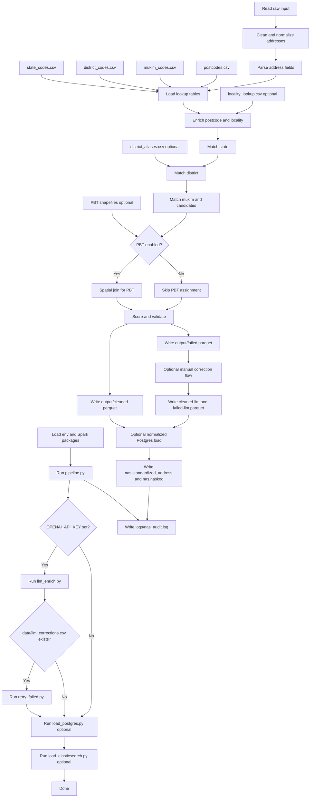

# Address Pipeline (Spark + Sedona + PostGIS)

Raw Address Dump -> Clean -> Save as Parquet using Spark, with Malaysian lookup enrichment, fuzzy matching, and optional PBT mapping via Sedona. Cleaned output can be loaded into PostGIS.

Quick runbook: see `docs/RUN_PIPELINE.md`.

## Directory Layout
```text
etl/        core data pipeline package
backend/    FastAPI backend
domain/     shared pure business rules (API/ETL/worker)
config/     pipeline configs
data/       inputs, lookups, boundaries
docs/       operational runbooks
docker/     database bootstrap SQL
```

## Workflow


Flow notes:
- `naskod` is written into parquet outputs as a column (`output/cleaned`, `output/failed`, and retry outputs).
- In Postgres normalized load, official codes are stored in `nas.naskod` table (not as a `naskod` column in `nas.standardized_address`).
- `run_all.sh` loads `output/cleaned` by default; loading `output/cleaned-llm` is a separate manual step.
- Elasticsearch loading is optional and controlled by `SKIP_ES` in `run_all.sh`.

## Files
- `etl/`: core ETL package (`extract`, `transform`, `pipeline`, loaders, lookup matching, audit helpers).
- `domain/`: pure domain module (`models`, `normalization`, `scoring`, `validation`, `exceptions`).
- `pipeline.py`: thin entrypoint wrapper to `etl.pipeline`.
- `load_postgres.py`: thin entrypoint wrapper to `etl.load_postgres`.
- `load_elasticsearch.py`: thin entrypoint wrapper to `etl.load_elasticsearch`.
- `search_elasticsearch.py`: thin entrypoint wrapper to `etl.search_elasticsearch`.
- `llm_enrich.py`: thin entrypoint wrapper to `etl.llm_enrich`.
- `retry_failed.py`: thin entrypoint wrapper to `etl.retry_failed`.
- `validate_env.py`: thin entrypoint wrapper to `etl.validate_env`.
- `backend/app/main.py`: FastAPI backend (`/api/v1/health`, `/api/v1/search/autocomplete`, `/api/v1/jobs`).
- `backend/app/services/ingest_service.py`: ingest orchestration service layer.
- `backend/app/services/address_read_service.py`: database read service layer for Postgres lookup endpoints.
- `backend/app/queue/producer.py`: async queue producer abstraction + Redis Stream/SQS/log implementations.
- `backend/app/workers/queue_consumer.py`: async worker consumer example.
- `run_all.sh`: one-step script to run pipeline + load.
- `docker-compose.yml`: PostGIS + optional Elasticsearch (`search`) + MinIO (`objectstore`) profiles.
- `.env`: runtime config used by Docker, backend, and loaders (a template is in `.env.example`).
- `config/config.json`: main pipeline config (column aliases, boundary/locality matching, replacements).

## Usage

Run the full pipeline (CSV folder):
```bash
python pipeline.py --input data/raw/pbt/2026-02/ --success output/cleaned/pbt/2026-02/ --failed output/failed/pbt/2026-02/
```

Other formats:
```bash
python pipeline.py --source-type json --input data/raw/pbt/2026-02/ --success output/cleaned/pbt/2026-02/ --failed output/failed/pbt/2026-02/
python pipeline.py --source-type excel --input data/raw/pbt/2026-02/pbt.xlsx --sheet 0 --success output/cleaned/pbt/2026-02/ --failed output/failed/pbt/2026-02/
```

Input and output paths are now passed via CLI:
- `--input`: file, folder, or glob
- `--success`: success output path
- `--failed`: failed output path
- `--config`: optional JSON config for column aliases
- `--checkpoint-root`: staged checkpoint folder root (default: `<success>_checkpoints`)
- `--resume`: resume from completed stage checkpoints (`_SUCCESS` marker)
- `--status-path`: record status parquet path (default: `<checkpoint-root>/90_record_status`)
- `--resume-failed-only`: process only records not marked `DONE` in status store

Note: Spark writes Parquet as a directory at the output path.

Checkpoint stages:
- `10_extract_raw`
- `20_clean`
- `30_validated_success`
- `31_validated_failed`
- `40_success_final`
- `41_failed_final`

Resume example:
```bash
python pipeline.py \
  --source-type json \
  --input "data/synthetic_data/*.json" \
  --config config/config.json \
  --success output/cleaned \
  --failed output/failed \
  --checkpoint-root output/checkpoints/nas_job_001 \
  --resume
```

Record-based retry example (process unfinished records only):
```bash
python pipeline.py \
  --source-type json \
  --input "data/synthetic_data/*.json" \
  --config config/config.json \
  --success output/cleaned \
  --failed output/failed \
  --checkpoint-root output/checkpoints/nas_job_001 \
  --resume \
  --resume-failed-only
```

## PostGIS (Docker Compose)
Start PostGIS:
```bash
docker compose up -d postgres
```

Local connection note:
- Docker Postgres is exposed on host port `5433` to avoid collisions with a separate local Postgres that may already use `5432`.
- Use `localhost:5433` from host tools such as `psql`, pgAdmin, or DBeaver.
- Inside Docker, services still connect to `postgres:5432`.

Example host-side check:
```bash
PGPASSWORD=postgres psql -h localhost -p 5433 -U postgres -d postgres -c 'select current_user;'
```

If you need to recreate the database:
```bash
docker compose down -v
docker compose up -d postgres
```

## Elasticsearch (Optional)
Start Elasticsearch:
```bash
docker compose up -d elasticsearch
```

Index cleaned output:
```bash
venv/bin/python load_elasticsearch.py \
  --input output/cleaned \
  --es-url http://localhost:9200 \
  --index nas_addresses \
  --recreate-index
```

Autocomplete query:
```bash
venv/bin/python search_elasticsearch.py \
  --q "jalan perdana johor" \
  --index nas_addresses \
  --size 10
```

## MinIO (Upload Object Store)
Start MinIO:
```bash
docker compose up -d minio
```

Default endpoints:
- API: `http://localhost:9000`
- Console: `http://localhost:9001`
- Credentials are read from `.env` (`MINIO_ACCESS_KEY` / `MINIO_SECRET_KEY`).
- Browser multipart uploads use `MINIO_PUBLIC_ENDPOINT`. Set it to a host/IP that the browser can actually reach.
  - Local-only example: `MINIO_PUBLIC_ENDPOINT=localhost:9000`
  - LAN example: `MINIO_PUBLIC_ENDPOINT=192.168.x.x:9000`

## Backend API
Run API server:
```bash
uvicorn backend.app.main:app --host 0.0.0.0 --port 8000 --reload
```
Backend checks required env vars at startup. Disable only for local troubleshooting:
```bash
STRICT_ENV_CHECK=false uvicorn backend.app.main:app --host 0.0.0.0 --port 8000 --reload
```
When `config/config.json` uses DB-backed lookups or boundaries, backend startup also verifies that the
required `nas_lookup` tables already exist. Disable only for local troubleshooting:
```bash
STRICT_LOOKUP_DB_CHECK=false uvicorn backend.app.main:app --host 0.0.0.0 --port 8000 --reload
```

Run worker (required when `INGEST_EXECUTION_MODE=queue_worker`):
```bash
python -m backend.app.workers.queue_consumer
```

Available API endpoints:
- `GET /api/v1/health`
- `GET /api/v1/search/autocomplete?q=jalan%20perdana&size=10`
- `GET /api/v1/jobs?limit=20`
- `GET /api/v1/jobs/{run_id}`
- `POST /api/v1/ingest/upload` (direct multipart/form-data upload for small/medium files)
- `POST /api/v1/ingest/uploads/multipart/initiate`
- `GET /api/v1/ingest/uploads/multipart/{session_id}`
- `POST /api/v1/ingest/uploads/multipart/{session_id}/part-url`
- `POST /api/v1/ingest/uploads/multipart/{session_id}/complete`
- `POST /api/v1/ingest/uploads/multipart/{session_id}/abort`
- `GET /api/v1/ingest/jobs?limit=20`
- `GET /api/v1/ingest/jobs/{job_id}`
- `POST /api/v1/ingest/jobs/{job_id}/start`
- `POST /api/v1/ingest/jobs/{job_id}/pause`

Upload + process flow:
1. For smaller files, the client sends `POST /api/v1/ingest/upload` directly to the backend.
2. For larger files, or when a saved resumable session exists, the client uses the multipart upload flow.
3. Multipart mode returns presigned part URLs so the browser can upload chunks directly to `nas-uploads`.
4. Backend creates or completes the ingest job record and queues the event (`QUEUE_BACKEND=redis_stream|log|sqs`).
5. Worker consumes the event and runs `pipeline.py` (and optional DB load).
6. Job output written to `output/uploads/<job_id>/cleaned|failed`.
7. Job log written to `logs/jobs/<job_id>.log`.

Dockerized API + worker:
```bash
docker compose up -d api worker
```

## Transform + Validate Behavior
The transform step expects a **full address string** in one column and performs:
- Auto-detects the address column (tries `address`, `full_address`, `alamat`, `raw_address`, `address_full`, `address_line`).
- If no single full-address column exists, auto-builds one from structured fields (for example: `house_no`, `street_name`, `locality`, `mukim`, `district`, `state`, `postcode`).
- If a new address column exists (`new_address`, `alamat_baru`, `address_new`), it is used for parsing, while the old address is retained.
- Parses `premise_no`, `lot_no`, `unit_no`, `floor_no`, `street_name`, `locality_name`, and `postcode`.
- Enriches locality/state from `postcodes.csv` when postcode is present.
- If coordinates exist and postcode boundary shapefiles are configured, resolves postcode zone by point-in-polygon and flags postcode boundary conflicts.
- Matches `state` exactly (substring).
- Matches `district` and `mukim` with fuzzy matching, constrained by the matched state and district.
- If coordinates exist and boundary shapefiles are configured, resolves `state/district/mukim` via spatial intersection and enforces alignment (conflicts are flagged and failed).
- Builds `top_3_candidates` for mukim using state/district-scoped candidate ranking, and can infer missing district/mukim when top candidate is strong.
- When coordinates exist, assigns `pbt_id` and `pbt_name` via Sedona spatial join using PBT shapefiles.

Fuzzy matching uses Levenshtein distance with thresholds:
- Names with length ≤ 5: max distance 1
- Longer names: max distance 2

Validation splits data into success/failed:
- Missing or invalid postcode
- Postcode/admin conflicts against boundary layers
- Missing state/district (and optionally mukim)
- Invalid state/district/mukim against lookup tables
- Low confidence (`confidence_score < 75`)
- Duplicate `address_clean`

Outputs are written to separate success/failed paths.
Success/failed parquet outputs also include `naskod` (standard format) when `state_code` and `district_code` are available.
Failed output includes `reason_codes`, `confidence_band`, and candidate context columns such as `top_3_candidates` and `candidate_match_score`.

## Manual Corrections (Retry Failed)
Use `retry_failed.py` to apply manual fixes and re-run cleaning + validation.

Corrections CSV format (minimum):
- `source_address` (original address string from failed output)
- `corrected_address` (fixed address string)

Example:
```csv
source_address,corrected_address
"No. 213, Jalan Beringin, Assam Kumbang, 34000 Taiping, Perak","No. 213, Jalan Beringin, Asam Kumbang, 34000 Taiping, Perak"
```

Run:
```bash
python retry_failed.py \
  --failed output/failed/2026-02/ \
  --corrections data/corrections.csv \
  --success output/cleaned/pbt/2026-02-retry/ \
  --failed-out output/failed/pbt/2026-02-retry/
```

## JSON Config (Column Aliases)
Use a JSON config to customize which columns are treated as old/new addresses and to enable PBT mapping:

```json
{
  "address_columns": ["address", "full_address", "alamat", "raw_address"],
  "new_address_columns": ["new_address", "alamat_baru", "alamat_bar"],
  "structured_address_columns": ["house_no", "street_name", "locality", "district", "state", "postcode"],
  "latitude_columns": ["latitude", "lat"],
  "longitude_columns": ["longitude", "lon", "lng"],
  "column_aliases": {
    "state_name": ["state", "negeri"],
    "district_name": ["district", "daerah"],
    "mukim_name": ["mukim"],
    "locality_name": ["locality", "bandar", "city"],
    "premise_no": ["house_no"],
    "address_type": ["building_type"]
  },
  "pbt_enabled": true,
  "pbt_dir": "data/boundary/Sempadan Kawalan PBT",
  "pbt_id_column": "pbt_id",
  "pbt_name_column": "NAMA_PBT",
  "pbt_simplify_tolerance": 0.00005,
  "boundary_source": "db",
  "boundary_db_schema": "nas_lookup",
  "pbt_boundary_table": "pbt",
  "state_boundary_table": "state_boundary",
  "district_boundary_table": "district_boundary",
  "mukim_boundary_table": "mukim_boundary",
  "postcode_boundary_table": "postcode_boundary",
  "admin_boundary_enabled": true,
  "state_boundary_dir": "data/boundary/01_State_boundary",
  "postcode_boundary_enabled": true,
  "postcode_boundary_dir": "data/boundary/02_Postcode_boundary",
  "postcode_boundary_postcode_column": "POSTCODE",
  "postcode_boundary_city_column": "TOWN_CITY",
  "postcode_boundary_state_column": "STATE",
  "postcode_boundary_simplify_tolerance": 0.00005,
  "district_boundary_dir": "data/boundary/03_District_boundary",
  "mukim_boundary_dir": "data/boundary/05_Mukim_boundary",
  "admin_boundary_simplify_tolerance": 0.00005,
  "lookup_source": "db",
  "lookup_db_schema": "nas_lookup",
  "lookup_cache_enabled": true,
  "lookup_memory_cache_enabled": true,
  "lookup_cache_dir": "output/lookups_cache"
}
```

Run with:
```bash
python pipeline.py --input data/raw/ --config config/address_aliases.json --success output/cleaned/ --failed output/failed/
```

For local Docker/Desktop runs, start with conservative Spark memory:
```bash
SPARK_DRIVER_MEMORY=2g SPARK_EXECUTOR_MEMORY=2g SPARK_SQL_SHUFFLE_PARTITIONS=16 bash run_all.sh
```

Increase these only after raising Docker Desktop memory; otherwise Spark can OOM-kill the worker JVM.

You can also define text replacements to normalize common address terms:
```json
{
  "text_replacements": {
    "KAMPUNG": "KG",
    "LORONG": "LRG",
    "JALAN": "JLN",
    "TAMAN": "TMN"
  }
}
```

## Load to Postgres/PostGIS
```bash
export $(cat .env | xargs)
export SPARK_JARS_PACKAGES="org.apache.sedona:sedona-spark-shaded-4.0_2.13:1.8.1,org.datasyslab:geotools-wrapper:1.8.1-33.1,org.postgresql:postgresql:42.7.3"
venv/bin/python load_postgres.py --input output/cleaned --mode overwrite --normalized
# This will also load PBT boundaries (if available in data/boundary/Sempadan Kawalan PBT),
# convert `geom` and `pbt.boundary_geom` into PostGIS geometry, and add GiST indexes.
#
# Note: tables are created under schema `nas` by default (PGSCHEMA=nas) to avoid
# conflicts with PostGIS Tiger geocoder's `public.state` table.
```

Spark/Sedona compatibility:
- Use `pyspark==4.0.x` with Sedona `1.8.1` for the default setup.
- Spark `4.1.x` may run with reduced Sedona compatibility.

## Bootstrap Lookup Tables To DB
Build canonical lookup tables from master files and write them into Postgres:
```bash
venv/bin/python bootstrap_lookups.py \
  --lookups-dir data/lookups \
  --granite-root data/granite_map_info-master \
  --locality-lookup data/lookups/locality_lookup.csv \
  --rebuild-locality-lookup \
  --schema nas_lookup
```

Then switch ETL lookup + boundary mode in `config/config.json`:
- `"lookup_source": "db"`
- `"boundary_source": "db"`
- `"pbt_boundary_table": "pbt"`
- keep `"lookup_cache_enabled": true` for versioned parquet cache reuse.

## NASKod (Standard + Vanity)
Standard format:
- `NAS-{STATE}-{DISTRICT}-{SUFFIX}`
- `STATE`: KL/SGR/JHR style
- `DISTRICT`: 2 digits
- `SUFFIX`: 6 digits

Examples:
- `NAS-KL-01-000123`
- `NAS-SGR-10-000999`

Vanity codes:
- Allowed chars: `A-Z0-9`
- Max suffix length: `12` (configurable via `--naskod-suffix-max`)
- Examples: `NAS-KL-01-SHOPEE`, `NAS-KL-01-888888`

`load_postgres.py --normalized` generates **standard** NASKod rows into `nas.naskod`.
Vanity codes can be inserted later with `is_vanity=true`.

## One-Step Run
```bash
bash run_all.sh
```

`run_all.sh` validates required env vars before execution using `validate_env.py`.
Disable check only if needed:
```bash
SKIP_ENV_CHECK=1 bash run_all.sh
```

`run_all.sh` input behavior:
- If `PIPELINE_INPUT` is set, it uses that path.
- Otherwise, it auto-uses `data/synthetic_data` and detects `csv/json/excel`.
- If `data/synthetic_data` is not present, it falls back to `data/raw/Sample Data.xlsx`.

`run_all.sh` performance modes:
- `FAST_MODE=1`: development mode, still uses `config/config.json`, skips LLM and Postgres load by default, writes to `output/cleaned-fast` and `output/failed-fast`.
- Optional `FAST_SAMPLE_ROWS=<n>`: when input is a CSV directory, samples first `<n>` rows from one file for quick smoke tests.
- Optional `PIPELINE_CHECKPOINT_ROOT=<path>`: checkpoint folder root.
- Optional `PIPELINE_RESUME=1`: resume pipeline from checkpoints.
- Optional `PIPELINE_STATUS_PATH=<path>`: record status store path.
- Optional `PIPELINE_RESUME_FAILED_ONLY=1`: process only records not marked `DONE`.
- Optional `SKIP_ES=0`: enable Elasticsearch startup + load.
- Optional `ES_URL=<url>`, `ES_INDEX=<name>`, `ES_RECREATE_INDEX=1`, `ES_INPUT=<parquet path>`.

Override examples:
```bash
PIPELINE_INPUT=data/synthetic_data PIPELINE_SOURCE_TYPE=csv bash run_all.sh
PIPELINE_INPUT=data/raw/Sample\ Data.xlsx PIPELINE_SOURCE_TYPE=excel PIPELINE_SHEET=0 bash run_all.sh
FAST_MODE=1 FAST_SAMPLE_ROWS=5000 bash run_all.sh
FAST_MODE=1 SKIP_LOAD=0 PIPELINE_SUCCESS=output/cleaned bash run_all.sh
PIPELINE_CHECKPOINT_ROOT=output/checkpoints/job1 PIPELINE_RESUME=1 bash run_all.sh
PIPELINE_CHECKPOINT_ROOT=output/checkpoints/job1 PIPELINE_RESUME=1 PIPELINE_RESUME_FAILED_ONLY=1 bash run_all.sh
SKIP_ES=0 ES_INDEX=nas_addresses bash run_all.sh
```

## Audit Log
Each major script now writes JSONL audit entries by default to:
- `logs/nas_audit.log`

You can override the path per command:
```bash
python pipeline.py ... --audit-log logs/audit_2026-02-19.log
python llm_enrich.py ... --audit-log logs/audit_2026-02-19.log
python retry_failed.py ... --audit-log logs/audit_2026-02-19.log
python load_postgres.py ... --audit-log logs/audit_2026-02-19.log
```

Or set one global path:
```bash
export NAS_AUDIT_LOG=logs/nas_audit.log
```

## LLM Enrichment (Optional)
Set your API key (do not commit it):
```bash
export OPENAI_API_KEY=...
```

Run:
```bash
venv/bin/python llm_enrich.py \
  --input output/failed \
  --output data/llm_corrections.csv \
  --min-confidence 60 \
  --limit 200
```

Then re-run corrections:
```bash
venv/bin/python retry_failed.py \
  --failed output/failed \
  --corrections data/llm_corrections.csv \
  --success output/cleaned-llm \
  --failed-out output/failed-llm \
  --require-mukim
```

## Install
```bash
python -m pip install -r requirements.txt
```
