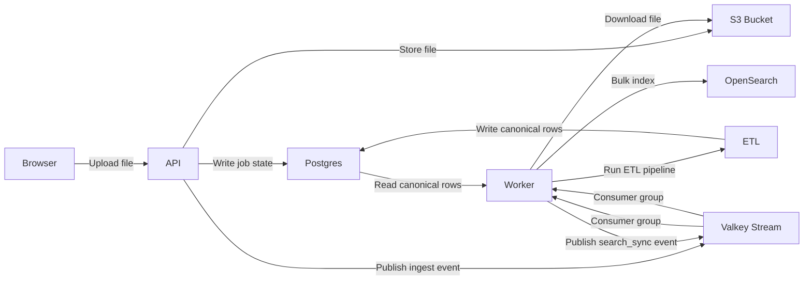

# NAS — National Address System

A full-stack address standardization system for Malaysia. Agencies submit raw address files through a web portal; the ETL pipeline normalizes, enriches, and loads them into a PostGIS/OpenSearch backend that serves a lookup API.

## Directory Layout

```text
backend/        FastAPI API server and queue worker
etl/            ETL pipeline: transform, validate, load, repositories
nas_core/       shared config/env helpers (used by backend and ETL)
config/         versioned ingest config (config.json)
data/
  boundary/     GeoJSON boundary files (5 layers)
  lookups_clean/ reference CSV files (11 tables)
  raw/          sample source data
docs/           operational runbooks
frontend-vue/   Vue 3 upload portal
alembic.ini     DB migration config
docker-compose.yml
Dockerfile.backend
```

## Quick Start (POC — single machine)

The POC runs everything on one machine with Docker Compose. Postgres/PostGIS, OpenSearch, and Valkey run as local containers. Object uploads go to S3.

**Requirements:** Docker, an S3 bucket, and a machine with at least 8 GB RAM (`t3.large` or equivalent — OpenSearch needs ~1.5 GB alone).

```bash
# 1. Set the required kernel parameter for OpenSearch
sudo sysctl -w vm.max_map_count=262144
echo "vm.max_map_count=262144" | sudo tee -a /etc/sysctl.conf

# 2. Copy and fill in the env file
cp .env.example .env
# Edit .env: set OBJECT_STORE_BUCKET, AWS_REGION, CORS_ALLOW_ORIGINS
# All DB/search/queue connection strings are already wired in docker-compose.yml

# 3. Bring up the stack
docker compose up -d

# 4. Check health
curl http://localhost:8000/api/v1/health
```

Startup order managed by Docker Compose:
1. `postgres` and `opensearch` start (with health checks)
2. `db-migrate` runs Alembic migrations against Postgres
3. `db-bootstrap` seeds the `nas_lookup` schema from `data/lookups_clean/` if not already populated
4. `api` and `worker` start and are ready to accept requests

## Architecture



## Data Model

### `nas` schema (application runtime)

Managed by Alembic migrations:
- `standardized_address` — canonical normalized address rows
- `naskod` — stable address identifiers (one per `address_id`)
- `ingest_job` — file upload and processing job state
- `multipart_upload` — chunked upload session tracking
- `agency`, `agency_api_key`, `user` — authentication and tenant tables

### `nas_lookup` schema (reference data)

Seeded at startup by `bootstrap_lookups_if_needed.py` from `data/lookups_clean/`:

| Table | Rows | Key columns |
|---|---|---|
| `state` | 16 | `state_id`, `state_code`, `state_name` |
| `district` | 170 | `district_id`, `state_id` FK |
| `district_aliases` | 1 | `district_id` FK |
| `mukim` | 1,834 | `mukim_id` (10-digit), `district_id` FK |
| `locality` | 3,098 | `locality_id`, `state_id` FK |
| `sublocality` | 98,137 | `sublocality_id`, `state_id` FK |
| `postcode` | 2,928 | `postcode_id`, `state_id`, `locality_id` FK |
| `street_type` | 74 | `street_type_id`, `street_type` |
| `street_type_alias` | 86 | `street_type_id` FK, `raw_type`, `canonical_type` |
| `street_name` | 251,926 | `state_id` FK, `street_name` |
| `state_boundary` | — | PostGIS geometry |
| `district_boundary` | — | PostGIS geometry |
| `mukim_boundary` | — | PostGIS geometry |
| `postcode_boundary` | — | PostGIS geometry |
| `pbt` | 71 | PostGIS geometry, `state_id` FK |
| `lookup_version` | — | idempotency metadata |

Bootstrap is idempotent: if all required keys already exist in `lookup_version`, the step is skipped.

## Ingest Config

`config/config.json` controls column detection, reference data sources, and address rules:

```json
{
  "config_version": "1.0.0",
  "schema": {
    "address_columns": ["address", "full_address", "alamat", "raw_address"],
    "new_address_columns": ["new_address", "alamat_baru", "alamat_bar", "alamatbaharu"],
    "structured_address_columns": ["premise_no", "street_name", "locality", "district", "state", "postcode"],
    "latitude_columns": ["latitude", "lat", "y"],
    "longitude_columns": ["longitude", "lon", "lng", "x"],
    "column_aliases": {
      "state_name": ["state", "negeri", "nama_negeri"],
      "district_name": ["district", "daerah", "nama_daerah"],
      "mukim_name": ["mukim", "nama_mukim"],
      "locality_name": ["locality", "bandar", "city", "pekan"],
      "premise_no": ["house_no", "house_number", "no_rumah"],
      "postcode": ["postcode", "poskod", "postal_code", "zip"]
    }
  },
  "sources": {
    "lookup_source": "db",
    "lookup_db_schema": "nas_lookup",
    "boundary_source": "db",
    "boundary_db_schema": "nas_lookup",
    "pbt_boundary_table": "pbt",
    "state_boundary_table": "state_boundary",
    "district_boundary_table": "district_boundary",
    "mukim_boundary_table": "mukim_boundary",
    "postcode_boundary_table": "postcode_boundary"
  },
  "rules": {
    "preserve_lot_no_from_source": false
  }
}
```

## ETL Pipeline

### Transform and validate behavior

The pipeline accepts CSV, Excel, or JSON/NDJSON input and:

- Auto-detects the address column (`address`, `full_address`, `alamat`, `raw_address`, or builds one from structured fields)
- Uses `new_address` / `alamat_baru` as the parsing target when present, retaining the original
- Parses `premise_no`, `lot_no`, `unit_no`, `floor_no`, `street_name`, `locality_name`, `postcode`
- Enriches locality and state from the DB-backed `postcode` lookup when postcode is present
- Matches `state` by substring; matches `district` and `mukim` with Levenshtein fuzzy matching (threshold: distance ≤ 1 for names ≤ 5 chars, ≤ 2 for longer names)
- When coordinates are present: resolves postcode zone, state/district/mukim, and PBT assignment via PostGIS spatial join — rows without coordinates skip spatial enrichment automatically
- Builds `top_3_candidates` for mukim; infers missing district/mukim when the top candidate is strong

Validation splits output into success and failed:
- Missing or invalid postcode
- Postcode/admin conflicts against boundary layers
- Missing state or district
- Low confidence (`confidence_score < 75`)
- Duplicate `address_clean`

### Run the pipeline directly

```bash
python -m etl.pipeline \
  --input data/raw/agency-batch.csv \
  --config config/config.json \
  --success output/cleaned/ \
  --failed output/failed/
```

Checkpoint and resume:
```bash
python -m etl.pipeline \
  --input data/raw/agency-batch.csv \
  --config config/config.json \
  --success output/cleaned/ \
  --failed output/failed/ \
  --checkpoint-root output/checkpoints/job001 \
  --resume \
  --resume-failed-only
```

Checkpoint stages: `10_extract_raw` → `20_clean` → `30_validated_success` / `31_validated_failed` → `40_success_final` / `41_failed_final`

### One-step run

```bash
bash run_all.sh
```

`run_all.sh` runs ETL → Postgres load → OpenSearch reindex. Required: `PIPELINE_INPUT`. Optional: `PIPELINE_SOURCE_TYPE`, `PIPELINE_RESUME`, `PIPELINE_CHECKPOINT_ROOT`, `PIPELINE_RESUME_FAILED_ONLY`.

## Backend API

### Run locally

```bash
uvicorn backend.app.main:app --host 0.0.0.0 --port 8000 --reload
python -m backend.app.workers.queue_consumer  # in a second terminal
```

### Scale workers

```bash
docker compose up -d --scale worker=2
```

One worker processes one ingest job at a time.

### Endpoints

```
GET  /api/v1/health
POST /api/v1/auth/token
GET  /api/v1/search/autocomplete?q=jalan+perdana&size=10
GET  /api/v1/ingest/jobs?limit=20
GET  /api/v1/ingest/jobs/{job_id}
POST /api/v1/ingest/upload
POST /api/v1/ingest/uploads/multipart/initiate
GET  /api/v1/ingest/uploads/multipart/{session_id}
POST /api/v1/ingest/uploads/multipart/{session_id}/part-url
POST /api/v1/ingest/uploads/multipart/{session_id}/complete
POST /api/v1/ingest/uploads/multipart/{session_id}/abort
POST /api/v1/ingest/jobs/{job_id}/start
POST /api/v1/ingest/jobs/{job_id}/pause
POST /api/v1/ingest/jobs/{job_id}/retry-failed-rows
```

OpenAPI docs: `http://localhost:8000/docs`

### Authentication

All `/api/v1/ingest/*` endpoints require one of:
- `Authorization: Bearer <jwt>` — JWT minted from an agency API key
- `X-API-Key: <agency-api-key>` — raw DB-backed key

**Mint a JWT:**

```bash
# Using X-API-Key header
curl -X POST http://localhost:8000/api/v1/auth/token \
  -H "X-API-Key: <agency-api-key>"

# Using client credentials body
curl -X POST http://localhost:8000/api/v1/auth/token \
  -H "Content-Type: application/json" \
  -d '{"grant_type":"client_credentials","client_id":"ak_xxx","client_secret":"yyy"}'
```

Token response:
```json
{ "access_token": "<jwt>", "token_type": "Bearer", "expires_in": 3600, "agency_id": "jpn" }
```

JWT env vars: `NAS_JWT_SIGNING_KEY` (required), `NAS_JWT_ISSUER`, `NAS_JWT_AUDIENCE`, `NAS_JWT_ACCESS_TTL_SECONDS`.

Idempotency: send `Idempotency-Key: <client-request-id>` on upload, initiate, start, and retry-failed-rows requests.

### Upload flow

**Small files** — POST directly:
```bash
curl -X POST http://localhost:8000/api/v1/ingest/upload \
  -H "Authorization: Bearer <jwt>" \
  -H "Idempotency-Key: jpn-001" \
  -F "file=@agency-batch.csv" \
  -F "auto_start=true"
```

**Large files** — multipart upload (browser chunks go directly to S3):
```bash
# 1. Initiate
curl -X POST http://localhost:8000/api/v1/ingest/uploads/multipart/initiate \
  -H "Authorization: Bearer <jwt>" \
  -H "Content-Type: application/json" \
  -d '{"file_name":"batch.csv","content_bytes":73400320,"auto_start":true}'

# 2. Get presigned URL per part
curl -X POST http://localhost:8000/api/v1/ingest/uploads/multipart/{session_id}/part-url \
  -H "Authorization: Bearer <jwt>" \
  -H "Content-Type: application/json" \
  -d '{"part_number":1}'

# 3. PUT chunk to the presigned URL (from browser, directly to S3)

# 4. Complete
curl -X POST http://localhost:8000/api/v1/ingest/uploads/multipart/{session_id}/complete \
  -H "Authorization: Bearer <jwt>" \
  -H "Content-Type: application/json" \
  -d '{"parts":[{"part_number":1,"etag":"abc123"}]}'
```

**Poll job status:**
```bash
curl http://localhost:8000/api/v1/ingest/jobs/{job_id} \
  -H "Authorization: Bearer <jwt>"
```

## OpenSearch

The search index is built from Postgres, not directly from upload files.

**Reindex:**
```bash
python -m backend.app.maintenance.reindex_search \
  --schema nas \
  --es-url http://localhost:9200 \
  --index nas_addresses \
  --recreate-index
```

**Autocomplete query:**
```bash
curl "http://localhost:8000/api/v1/search/autocomplete?q=jalan%20perdana%20johor&size=10"
```

OpenSearch runs on `http://opensearch:9200` inside Docker Compose (security disabled for POC). In production, enable security and set `ES_URL` accordingly.

## Object Storage (S3)

```env
OBJECT_STORE_BUCKET=nas-uploads-prod
AWS_REGION=ap-southeast-1
OBJECT_STORE_ENDPOINT=          # leave empty for real AWS S3
OBJECT_STORE_PUBLIC_ENDPOINT=   # leave empty for real AWS S3
OBJECT_STORE_SECURE=true
OBJECT_STORE_USE_PATH_STYLE=false
OBJECT_STORE_MANAGE_CORS=false
AWS_ACCESS_KEY_ID=              # leave empty when using IAM role
AWS_SECRET_ACCESS_KEY=
```

Minimum S3 permissions for API and worker:
- `s3:ListBucket`
- `s3:GetObject`
- `s3:PutObject`
- `s3:AbortMultipartUpload`
- `s3:ListBucketMultipartUploads`
- `s3:ListMultipartUploadParts`

S3 CORS config (required for browser multipart upload):
```json
[{
  "AllowedHeaders": ["*"],
  "AllowedMethods": ["GET", "PUT", "POST", "HEAD"],
  "AllowedOrigins": ["http://<your-domain>:8000"],
  "ExposeHeaders": ["ETag"],
  "MaxAgeSeconds": 3600
}]
```

## DB Migrations

```bash
# Via Docker Compose (runs automatically on startup)
docker compose up db-migrate

# Locally
alembic upgrade head
```

## Admin API

Admin endpoints require `X-Admin-Token: <NAS_ADMIN_TOKEN>`.

**Agency API keys:**
```
POST /api/v1/admin/agencies/{agency_id}/api-keys
GET  /api/v1/admin/agencies/{agency_id}/api-keys
POST /api/v1/admin/api-keys/{key_id}/revoke
POST /api/v1/admin/api-keys/{key_id}/rotate
```

Key format: `key_id.secret` (e.g. `ak_2f6c4df54a6b8f10.vx8K...`). The plaintext key is returned once on create or rotate; only a hash is stored.

**Lookup admin** (create/update state, district, mukim, locality, postcode records):
```
GET/POST   /api/v1/admin/lookups/states
GET/POST/PATCH /api/v1/admin/lookups/districts/{district_id}
GET/POST/PATCH /api/v1/admin/lookups/mukim/{mukim_id}
GET/POST/PATCH /api/v1/admin/lookups/localities/{locality_id}
GET/POST/PATCH /api/v1/admin/lookups/postcodes/{postcode_id}
```

**Boundary admin** (upload and activate full GeoJSON snapshots):
```
POST /api/v1/admin/boundaries/uploads
GET  /api/v1/admin/boundaries/versions
POST /api/v1/admin/boundaries/versions/{version_id}/activate
```

Boundary types: `state_boundary`, `district_boundary`, `mukim_boundary`, `postcode_boundary`, `pbt`. Each feature must include `boundary_wkt` plus the identifier fields for that layer.

### Lookup backfill

After changing a lookup record, update affected canonical addresses:

```bash
# Dry run
python -m backend.app.maintenance.backfill_lookup_refs --entity district --from-id 7 --to-id 19

# Apply
python -m backend.app.maintenance.backfill_lookup_refs --entity district --from-id 7 --to-id 19 --apply
```

Works for `district`, `mukim`, `locality`, `postcode`. Preserves existing `naskod.code` values.

### Spatial boundary reassignment

After activating new boundary geometries:

```bash
# Dry run
python -m backend.app.maintenance.backfill_spatial_refs

# Apply
python -m backend.app.maintenance.backfill_spatial_refs --apply

# Null unmatched fields instead of preserving them
python -m backend.app.maintenance.backfill_spatial_refs --clear-unmatched --apply
```

## Identity Model

- `address_id` — canonical internal identity of one standardized address row (never changes)
- `state_id`, `district_id`, `mukim_id`, `locality_id`, `postcode_id`, `pbt_id` — classification links; can change after lookup or boundary remaps
- `naskod.code` — stable business identifier (e.g. `NAS-KL-01-R000123`); preserved through all admin changes

NASKod format: `NAS-{STATE}-{DISTRICT}-{TYPE}{SUFFIX}`
- STATE: `KL`, `SGR`, `JHR`, etc.
- DISTRICT: 2 digits
- TYPE: `R` (residential), `C` (commercial), `O` (office), `I` (industrial)
- SUFFIX: 6 digits (standard) or up to 12 alphanumeric chars (vanity)

## Manual Corrections (Retry Failed)

```bash
python -m etl.jobs.retry_failed \
  --failed output/failed/2026-04/ \
  --corrections data/corrections.csv \
  --success output/cleaned/2026-04-retry/ \
  --failed-out output/failed/2026-04-retry/
```

Corrections CSV minimum columns: `source_address`, `corrected_address`.

Via API (corrections against an existing job's failed rows):
```bash
curl -X POST http://localhost:8000/api/v1/ingest/jobs/<job_id>/retry-failed-rows \
  -H "Authorization: Bearer <jwt>" \
  -F "file=@corrections.csv" \
  -F "auto_start=true"
```

## LLM Enrichment (Optional)

```bash
export OPENAI_API_KEY=...

python -m etl.transform.llm.enrich \
  --input output/failed \
  --output data/llm_corrections.csv \
  --min-confidence 60 \
  --limit 200

python -m etl.jobs.retry_failed \
  --failed output/failed \
  --corrections data/llm_corrections.csv \
  --success output/cleaned-llm \
  --failed-out output/failed-llm
```

## Frontend

The upload portal is a Vue 3 single-page app. It provides a drag-and-drop file upload zone, inline progress tracking, and an address search interface.

```bash
cd frontend-vue
npm install
npm run dev        # development server on :5173
npm run build      # production build into dist/
```

Set `VITE_API_BASE_URL` in `frontend-vue/.env` to point at the API server.

## Audit Log

All pipeline scripts write JSONL audit entries to `logs/nas_audit.log` (override with `NAS_AUDIT_LOG`):

```bash
python -m etl.pipeline ... --audit-log logs/audit_2026-04.log
```

## Inspect the Queue

```bash
docker compose exec valkey valkey-cli XINFO STREAM bulk_ingest_events
docker compose exec valkey valkey-cli XINFO GROUPS bulk_ingest_events
docker compose exec valkey valkey-cli XPENDING bulk_ingest_events bulk_ingest_workers
```

## Install (local development)

```bash
python -m pip install -r requirements.txt
```
