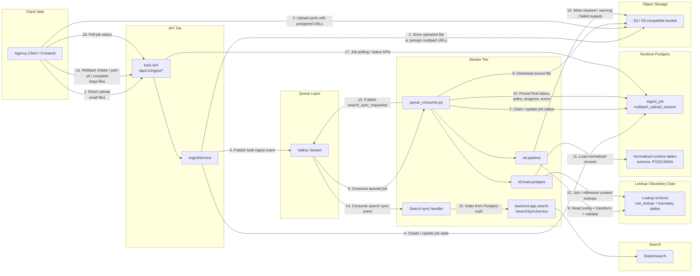
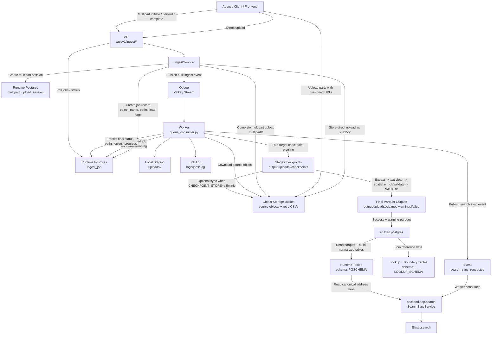
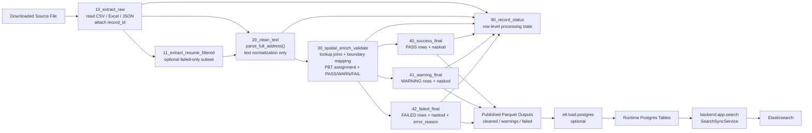

# Ingestion Architecture

## Notes

- The API accepts uploads and creates ingest jobs, but in production it should stay stateless.
- The worker is the component that actually executes the ingest pipeline when `INGEST_EXECUTION_MODE=queue_worker`.
- Source files are stored in object storage before processing.
- Job state and multipart session state live in Postgres runtime tables.
- The queue backend is Valkey Streams.
- Elasticsearch sync is backend-owned and indexes from Postgres, not parquet.
- Search sync is queued as `search_sync_requested` after the DB load succeeds, so ingest completion is not failed by an Elasticsearch outage.
- Lookup and boundary data are separate from runtime ingest tables and are used during validation/enrichment.

## Detailed Ingest Flow

## Pipeline Internals

## Retry Failed Rows Flow

```mermaid
flowchart LR
    parent["Parent Job\nfailed parquet exists"]
    usercsv["Corrections CSV\nmust include record_id"]
    retryapi["POST /api/v1/ingest/jobs/{job_id}/retry-failed-rows"]
    retryobj["Bucket Object\nretry_failed_rows/<parent>/<retry>/<file>"]
    retryjob["Retry Job Record\njob_type=retry_failed_rows"]
    retryworker["Worker"]
    failedset["Parent Failed Parquet"]
    merge["Join corrections by record_id\nreplace editable fields"]
    reclean["20_clean_text\nre-run text normalization"]
    revalidate["30_spatial_enrich_validate\nre-run spatial enrichment + validation"]
    naskod["40_generate_naskod"]
    retryout["Retry Outputs\ncleaned / warnings / failed"]
    loadpg["etl.load.postgres\noptional"]
    runtime["Runtime Postgres"]

    usercsv --> retryapi
    retryapi -->|"Upload corrections CSV"| retryobj
    retryapi -->|"Create retry job"| retryjob
    retryjob --> retryworker

    retryworker -->|"Download corrections CSV"| retryobj
    retryworker -->|"Read source_failed_path"| failedset
    failedset --> merge
    retryobj --> merge
    merge --> reclean
    reclean --> revalidate
    revalidate --> naskod
    naskod --> retryout
    retryout --> loadpg
    loadpg --> runtime
```

## Refactor Map

- Target stage `20_clean_text`
  Current owner: `clean_addresses()` in [etl/transform/address/normalize.py](/Users/adibakbar/Software_Development/disd-nas/etl/transform/address/normalize.py:1048)
  Keep here:
  - address column detection and structured-address composition
  - `parse_full_address(...)`
  - text normalization for premise, street, locality, postcode, state, district, mukim
  - non-spatial lookup canonicalization and fuzzy matching
  Move out:
  - `_assign_postcode_from_boundary(...)`
  - `_assign_admin_from_boundaries(...)`
  - `_assign_pbt(...)`

- Target stage `30_spatial_enrich_validate`
  Current owners: spatial work inside `clean_addresses()` plus status split in `validate_addresses()`
  New responsibility:
  - load postcode/admin/PBT boundary datasets
  - run GeoPandas/Shapely intersections and conflict flags
  - enrich PBT and boundary-derived admin fields
  - run `validate_addresses()` after spatial flags are present
  Candidate extracted helpers:
  - `enrich_spatial_components(df, config=..., postcode_boundaries=..., admin_boundaries=..., pbt_boundaries=...)`
  - `split_validated_outputs(df, require_mukim=...)`

- Target stage `40_generate_naskod`
  Current owner: finalize block in [etl/pipeline/etl.pipeline](/Users/adibakbar/Software_Development/disd-nas/etl/pipeline/etl.pipeline:919)
  Keep here:
  - `add_standard_naskod(...)`
  - final PASS / WARNING / FAILED output shaping
  - final parquet writes

- Pipeline changes in [etl/pipeline/etl.pipeline](/Users/adibakbar/Software_Development/disd-nas/etl/pipeline/etl.pipeline:535)
  Replace current flow:
  - `extract -> clean -> validate -> finalize`
  With target flow:
  - `extract -> clean_text -> spatial_enrich_validate -> generate_naskod`
  Rename checkpoints to make stage intent explicit:
  - `20_clean_text`
  - `30_spatial_validated_success`
  - `31_spatial_validated_failed`
  - `40_success_final`
  - `41_warning_final`
  - `42_failed_final`

- Retry flow changes in [etl/jobs/retry_failed_rows.py](/Users/adibakbar/Software_Development/disd-nas/etl/jobs/retry_failed_rows.py:1)
  Replace:
  - `clean_addresses(...) -> validate_addresses(...) -> add_standard_naskod(...)`
  With:
  - `clean_text_addresses(...) -> enrich_spatial_components(...) -> validate_addresses(...) -> add_standard_naskod(...)`
  This keeps retry behavior aligned with the main pipeline.

- Recommended extraction order
  1. Split `clean_addresses()` into:
     - `clean_text_addresses(...)`
     - `enrich_spatial_components(...)`
  2. Update `etl.pipeline` to use the new stage boundary names and checkpoints.
  3. Update `etl.jobs.retry_failed_rows` to call the same split functions.
  4. Only after behavior is stable, rename old checkpoint folders or add migration/backward-compat handling for resume logic.

- Main risk areas
  - checkpoint resume compatibility, because current `--resume` logic expects old stage names
  - row-level status rebuilding in `90_record_status`
  - retry flow assumptions, because failed parquet currently already contains some spatially-derived columns
  - test coverage around boundary conflicts and PBT assignment after function extraction
