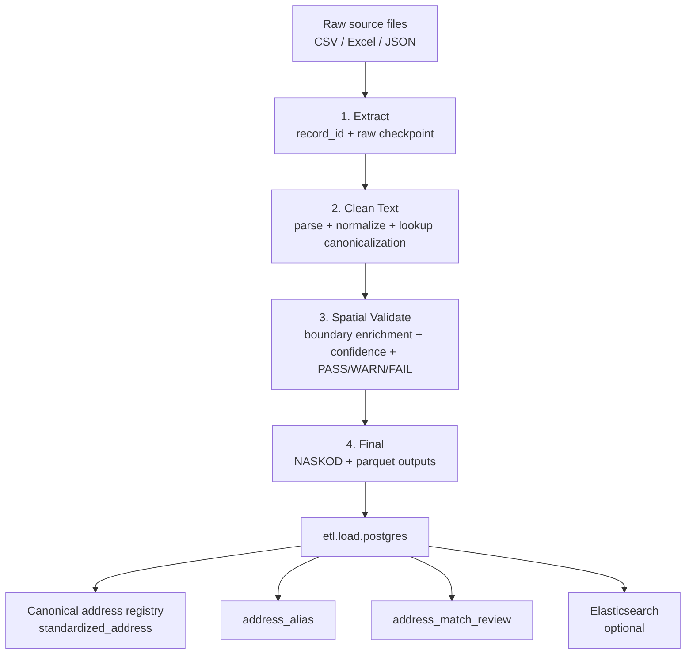
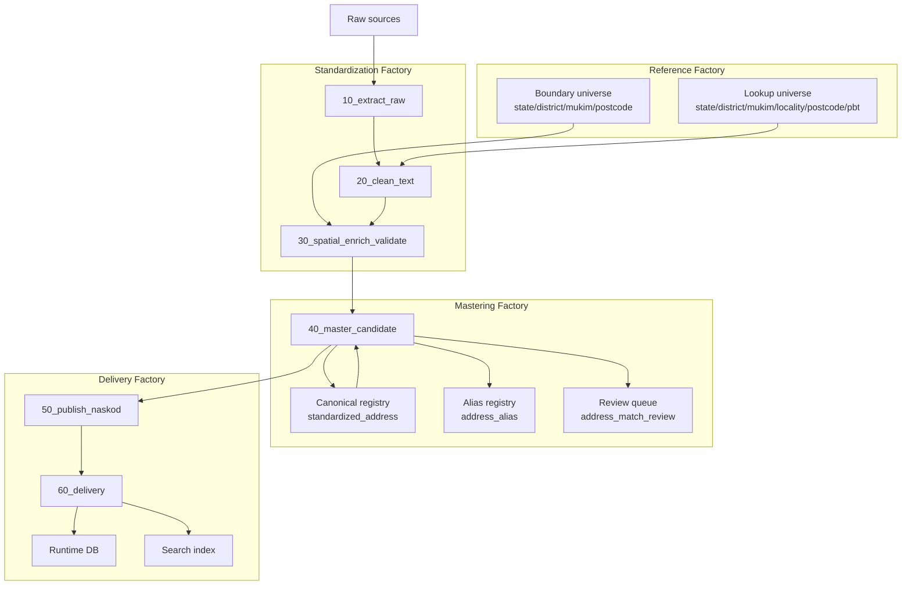

# NAS Factory Model

## Purpose

This document defines what the NAS system is supposed to be as a factory, and separates:

- what the code does today
- what the target NAS factory should do
- which parts are deterministic vs fuzzy
- which responsibilities are still mixed together

The goal is to describe NAS as a system, not just as a set of scripts.

## Executive Summary

Today, NAS is best described as:

> a rule-based address standardization and canonicalization factory with spatial validation, deterministic near-match merging, and manual review for ambiguous candidates.

That is more accurate than calling it a fully fuzzy-matching factory.

The current repo already has:

- a 4-stage ETL pipeline
- lookup and boundary-driven normalization
- spatial validation
- deterministic address mastering during DB load
- alias storage for multi-source address variants
- a manual review queue for ambiguous merges

The current repo does not yet have:

- a fully separate mastering stage in the ETL pipeline
- a dedicated canonical registry pipeline distinct from DB load
- a fuzzy entity-resolution engine for whole-address record linkage
- a clean separation between standardization, mastering, and delivery

## Current Factory Model

### What Actually Exists

The real pipeline checkpoints in code are:

1. `extract`
2. `clean_text`
3. `spatial_validate`
4. `final`

These are implemented in [etl/pipeline/etl.pipeline](/Users/adibakbar/Software_Development/disd-nas/etl/pipeline/etl.pipeline:712).

### Current Responsibilities

#### 1. Extract

Responsibilities:

- read CSV / Excel / JSON
- attach `record_id`
- create raw checkpoint state

Key code:

- [etl/pipeline/etl.pipeline](/Users/adibakbar/Software_Development/disd-nas/etl/pipeline/etl.pipeline:680)

#### 2. Clean Text

Responsibilities:

- detect source address column
- choose new vs old address text
- parse raw address string
- normalize components
- canonicalize locality and sub-locality with lookup matching
- infer postcode/city/state hints from lookup data

Key code:

- [etl/transform/address/normalize.py](/Users/adibakbar/Software_Development/disd-nas/etl/transform/address/normalize.py:1464)
- [etl/transform/address/normalize.py](/Users/adibakbar/Software_Development/disd-nas/etl/transform/address/normalize.py:2095)

#### 3. Spatial Validate

Responsibilities:

- enrich candidate rows with boundary-derived postcode/admin/PBT
- compute confidence score and confidence band
- classify `PASS`, `WARNING`, `FAIL`
- detect duplicate `address_clean` values inside the batch

Key code:

- [etl/transform/address/normalize.py](/Users/adibakbar/Software_Development/disd-nas/etl/transform/address/normalize.py:2107)
- [etl/transform/address/normalize.py](/Users/adibakbar/Software_Development/disd-nas/etl/transform/address/normalize.py:2125)

#### 4. Final

Responsibilities:

- generate final `naskod`
- shape success/warning/failed outputs
- publish final parquet outputs

Key code:

- [etl/pipeline/etl.pipeline](/Users/adibakbar/Software_Development/disd-nas/etl/pipeline/etl.pipeline:839)

### Where Canonical Matching Happens Today

Canonical address matching does not happen inside the 4 ETL checkpoints.

It currently happens later in [etl/load/postgres.py](/Users/adibakbar/Software_Development/disd-nas/etl/load/postgres.py:1230), during normalized DB load.

That loader is currently responsible for:

- generating `checksum`
- generating `canonical_address_key`
- exact reuse of existing addresses
- near-match scoring against existing canonical addresses
- creating `address_alias`
- creating `address_match_review`
- creating new canonical addresses when no safe reuse is found

That means the current system already has mastering behavior, but it is embedded in the load step rather than expressed as its own pipeline stage.

## Fuzzy vs Deterministic Matching

This is the most important distinction.

### Fuzzy Matching That Exists Today

The code does have fuzzy matching, but only for lookup normalization.

Examples:

- `match_lookup_fuzzy(...)`
- `match_mukim_fuzzy(...)`

These are used to canonicalize:

- locality names
- sub-locality names
- mukim names

Key code:

- [etl/transform/address/normalize.py](/Users/adibakbar/Software_Development/disd-nas/etl/transform/address/normalize.py:1768)
- [etl/transform/address/normalize.py](/Users/adibakbar/Software_Development/disd-nas/etl/transform/address/normalize.py:1840)

### Deterministic Matching That Exists Today

Cross-source canonical address matching is currently deterministic and rule-based.

It uses:

- exact reuse by `checksum`
- exact reuse by `canonical_address_key`
- weighted structured match scoring across:
  - `state_id`
  - `postcode_id`
  - `district_id`
  - `locality_id`
  - `street_id`
  - `pbt_id`
  - `premise_no`
  - `lot_no`
  - `building_name`
  - `unit_no`
  - `floor_level`

Key code:

- [etl/load/postgres.py](/Users/adibakbar/Software_Development/disd-nas/etl/load/postgres.py:385)

This is not fuzzy full-address entity resolution. It is structured weighted matching after standardization.

### Practical Interpretation

So the current NAS behaves like this:

- fuzzy matching for lookup cleanup
- deterministic scoring for canonical mastering

That is acceptable, but the terminology should stay precise.

## Current-State System Diagram

## Why The Current Model Is Incomplete

The current model works, but it mixes responsibilities:

- ETL standardization is in `etl.pipeline` and `transform.py`
- mastering is in `etl.load.postgres`
- delivery is also in `etl.load.postgres`

This creates three problems:

1. The canonical-mastering logic is hard to reason about because it is hidden inside DB load.
2. The output of ETL is not yet an explicit mastered-candidate checkpoint.
3. It is hard to evolve review logic, alias logic, and merge scoring independently from runtime table loading.

## Target NAS Factory

The cleaner target model is:

1. Reference Factory
2. Standardization Factory
3. Mastering Factory
4. Delivery Factory

### 1. Reference Factory

Responsibilities:

- manage lookup refresh
- manage boundary refresh and activation
- maintain canonical reference IDs
- publish active lookup universe used by ETL

Main artifacts:

- `state`, `district`, `mukim`, `locality`, `postcode`, `pbt`
- `state_boundary`, `district_boundary`, `mukim_boundary`, `postcode_boundary`

### 2. Standardization Factory

Responsibilities:

- parse source records
- normalize address text
- resolve canonical lookup IDs
- enrich with spatial context
- assign validation result and confidence

Main output:

- a standardized candidate address dataset

This is what the current 4-stage ETL mostly already does.

### 3. Mastering Factory

Responsibilities:

- compare standardized candidates to existing canonical address registry
- exact reuse when already known
- deterministic or probabilistic near-match evaluation
- create review queue for ambiguous candidates
- create aliases for source variants
- decide whether candidate becomes:
  - existing canonical address
  - reviewed merge candidate
  - new canonical address

This exists today logically, but only inside `etl.load.postgres`.

### 4. Delivery Factory

Responsibilities:

- publish parquet outputs
- load runtime tables
- sync search indexes
- persist audit trail and job progress

This exists today, but is mixed with mastering logic.

## Target-State Pipeline

The target ETL/mastering flow should be:

1. `10_extract_raw`
2. `20_clean_text`
3. `30_spatial_enrich_validate`
4. `40_master_candidate`
5. `50_publish_naskod`
6. `60_delivery`

### Stage Definitions

#### `10_extract_raw`

- source ingestion only
- no address decisions

#### `20_clean_text`

- parse full address
- normalize fields
- lookup exact/fuzzy normalization
- no spatial or canonical merge yet

#### `30_spatial_enrich_validate`

- point-in-polygon enrichment
- postcode/admin/PBT reconciliation
- confidence scoring
- `PASS / WARNING / FAIL`

#### `40_master_candidate`

- build canonical identity fingerprint
- build source alias variant
- exact match to existing canonical address
- structured near-match scoring
- create review queue for ambiguous cases

#### `50_publish_naskod`

- assign or reuse NASKOD
- shape mastered outputs

#### `60_delivery`

- write runtime DB tables
- write search index
- write status/audit results

## Target-State Diagram

## Recommended Architectural Rules

### Rule 1: Text Standardization Must End Before Mastering Begins

Mastering should never operate directly on raw source text.

It should operate on:

- cleaned structured components
- canonical lookup IDs
- spatially enriched flags

### Rule 2: Review Queue Must Belong To Mastering, Not Validation

Validation says:

- is this address structurally good enough?

Mastering says:

- is this address already known or new?

Those are different problems and should stay separate.

### Rule 3: `etl.load.postgres` Should Stop Owning Mastering Long-Term

Long-term, `etl.load.postgres` should be a delivery mechanism, not the place where the canonical identity decision is made.

The canonical merge decision should happen earlier in an explicit mastered-candidate stage.

### Rule 4: Aliases Are First-Class Data

NAS should preserve multi-source transparency by storing source-specific variants as aliases, not by duplicating canonical address rows.

That means:

- one canonical address
- many aliases
- review decides whether a source variant joins the canonical address or becomes a new one

## Proposed Data Contracts

### Standardized Candidate Output

The standardization factory should output at least:

- `record_id`
- `address_clean`
- `premise_no`
- `lot_no`
- `unit_no`
- `floor_level`
- `building_name`
- `street_id`
- `locality_id`
- `mukim_id`
- `district_id`
- `state_id`
- `postcode_id`
- `pbt_id`
- `validation_status`
- `confidence_score`
- `reason_codes`

### Mastering Output

The mastering factory should output one of:

- `resolved_to_existing_address_id`
- `new_canonical_address_id`
- `review_id`

Plus:

- `canonical_address_key`
- `checksum`
- `raw_address_variant`
- `normalized_address_variant`
- `match_score`
- `match_reasons`

## Refactor Priorities

The highest-value next steps are:

1. Create an explicit mastered-candidate stage after `spatial_validate`
2. Move canonical matching logic out of `etl.load.postgres` into a mastering module
3. Make `etl.load.postgres` consume mastering results instead of deciding identity itself
4. Keep lookup fuzzy matching inside standardization only
5. Keep review queue logic attached to mastering only

## Accurate Description For Stakeholders

If this repo needs one short description today, use this:

> NAS is a reference-driven address factory that standardizes raw address inputs, validates them spatially, and masters them into a canonical address registry using deterministic match scoring plus manual review for ambiguous cases.

That description matches the codebase better than:

- “pure fuzzy matching engine”
- “just an ETL pipeline”
- “just a DB loader”

