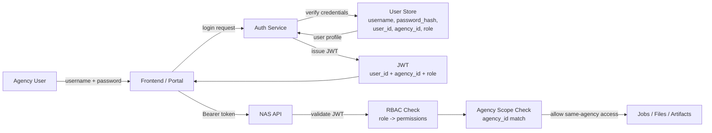

# Object Store Naming And RBAC Design

## Scope

This document defines the target storage layout and authorization model for agency-scoped ingest.

It covers:

- exact bucket prefix schema
- object metadata fields
- RBAC by endpoint
- implementation changes needed in `backend/app/services/ingest_service.py`
- implementation changes needed in `backend/app/security.py`

It does not cover:

- database schema migrations in detail
- worker queue permissions in AWS IAM policy syntax
- object lifecycle/retention policy implementation details

## Design Goals

- Make `agency_id` the primary tenancy boundary.
- Make every job-owned object attributable to one `agency_id` and one `job_id`.
- Unify direct upload and multipart upload under the same logical source-object path.
- Keep retry artifacts grouped under the parent job.
- Keep bucket naming readable for audit and incident response.
- Make route authorization and object-store prefix authorization align.
- Avoid mixing content-addressed storage keys with user-facing job keys.

## Current Gaps

Current object keys are inconsistent:

- direct upload: `sha256/<content_sha256>`
- multipart upload: `multipart/<session_id>/<file>`
- retry corrections: `retry_failed_rows/<parent_job_id>/<retry_job_id>/<file>`

Current authentication is agency-scoped, but not role-based:

- agency JWT/API key auth resolves `agency_id`
- ingest jobs and multipart sessions persist `agency_id`
- admin routes use a separate global admin token

That gives tenancy, but not a clean naming model and not a reusable RBAC model.

## Bucket Strategy

Use separate buckets per environment:

- `nas-ingest-dev`
- `nas-ingest-staging`
- `nas-ingest-prod`

Do not mix environments in the same bucket via prefixes alone.

## Prefix Schema

### Naming Rules

- All agency-owned objects must start with `agency/<agency_id>/`.
- All job-owned objects must include `jobs/<job_id>/`.
- Original filenames may appear only as the final path segment.
- Object keys are immutable after creation.
- Retry artifacts stay under the parent job.
- Optional deduplicated blob storage is hidden under `system/` and never exposed as the primary job key.

### Exact Prefixes

| Prefix | Purpose | Producer | Phase |
| --- | --- | --- | --- |
| `agency/<agency_id>/jobs/<job_id>/source/original/<safe_file_name>` | canonical source object for direct or multipart upload | API | Phase 1 |
| `agency/<agency_id>/jobs/<parent_job_id>/retries/<retry_job_id>/corrections/<safe_file_name>` | retry corrections CSV | API | Phase 1 |
| `agency/<agency_id>/jobs/<job_id>/manifests/job.json` | immutable job manifest | API | Phase 1 |
| `agency/<agency_id>/jobs/<job_id>/manifests/retry.json` | immutable retry manifest | API | Phase 1 |
| `agency/<agency_id>/jobs/<job_id>/outputs/cleaned/` | success parquet dataset | Worker | Phase 2 |
| `agency/<agency_id>/jobs/<job_id>/outputs/warnings/` | warning parquet dataset | Worker | Phase 2 |
| `agency/<agency_id>/jobs/<job_id>/outputs/failed/` | failed parquet dataset | Worker | Phase 2 |
| `agency/<agency_id>/jobs/<job_id>/checkpoints/<stage_name>/` | ETL stage checkpoints | Worker | Phase 2 |
| `agency/<agency_id>/jobs/<job_id>/logs/worker.log` | worker job log | Worker | Phase 2 |
| `system/blobs/sha256/<aa>/<bb>/<full_sha256>` | optional internal deduplicated blob storage | API/Worker | Phase 3 |

### Examples

Direct upload:

```text
agency/jpj/jobs/6b3785f8e6d14743b6d11ed5ec8ff145/source/original/agency_batch_20260421.csv
```

Multipart upload:

```text
agency/jpj/jobs/6b3785f8e6d14743b6d11ed5ec8ff145/source/original/agency_batch_20260421.csv
```

Retry corrections:

```text
agency/jpj/jobs/6b3785f8e6d14743b6d11ed5ec8ff145/retries/9a7f0b4149cb4ec3b4a4d4c9b1468b17/corrections/corrections_round_1.csv
```

Manifest:

```text
agency/jpj/jobs/6b3785f8e6d14743b6d11ed5ec8ff145/manifests/job.json
```

### Multipart Rule

Multipart uploads must use the final canonical source key from the start.

That means the API must allocate `job_id` before calling `create_multipart_upload`, then use:

```text
agency/<agency_id>/jobs/<job_id>/source/original/<safe_file_name>
```

This avoids:

- a temporary `multipart/<session_id>/...` namespace
- copy/delete promotion after completion
- key mismatch between direct and multipart uploads

### Dedup Rule

Deduplication must not be the primary user-facing object key.

If deduplication is needed later:

- store the physical blob under `system/blobs/sha256/...`
- keep the job-owned logical source key unchanged
- record the blob reference in DB and/or manifest

This keeps tenancy readable and avoids exposing cross-agency shared blob paths to clients.

## Object Metadata Contract

### Metadata Principles

- Do not store secrets, access tokens, or PII in object metadata.
- Keep object metadata small and index-like.
- Store detailed operational metadata in the runtime DB and manifest object.
- Mirror only the most useful routing/audit fields into object metadata.

### Required Object Metadata

These fields should be written as object metadata on source and retry objects. Lower-case keys are recommended.

| Field | Example | Applies To | Notes |
| --- | --- | --- | --- |
| `schema-version` | `v1` | all bucket objects | storage layout version |
| `environment` | `prod` | all bucket objects | dev/staging/prod |
| `agency-id` | `jpj` | all agency-owned objects | tenancy boundary |
| `job-id` | `6b3785f8...` | job-owned objects | required for source/output/checkpoint/log |
| `artifact-class` | `source` | all bucket objects | one of `source`, `retry_corrections`, `manifest`, `checkpoint`, `output`, `log`, `blob` |
| `artifact-kind` | `original` | all bucket objects | finer-grained subtype such as `original`, `corrections`, `cleaned`, `warnings`, `failed`, `job_manifest` |
| `created-at` | `2026-04-21T03:15:22Z` | all bucket objects | UTC ISO-8601 |
| `created-by` | `agency:jpj` | source/retry/manifest | principal that initiated write |
| `auth-scheme` | `jwt:db_api_key` | source/retry/manifest | copied from request principal |
| `content-sha256` | `<hex>` | source/retry if known | for multipart this may be blank initially |
| `content-type` | `text/csv` | source/retry | mirror request content type |
| `source-type` | `csv` | source/retry | inferred source type |
| `retention-class` | `standard` | all bucket objects | e.g. `standard`, `temp`, `audit` |

### Conditional Metadata

| Field | Example | Applies To | Notes |
| --- | --- | --- | --- |
| `parent-job-id` | `6b3785f8...` | retry objects | points to original ingest job |
| `retry-job-id` | `9a7f0b41...` | retry objects | retry job identifier |
| `session-id` | `18d9...` | multipart source objects | preserve upload session linkage |
| `stage-name` | `20_clean_text` | checkpoints | required for checkpoint objects |
| `validation-status` | `failed` | final output objects | only if outputs move to bucket |
| `blob-ref` | `system/blobs/sha256/ab/cd/...` | source manifest | optional future dedup linkage |

### Manifest Content

Each job should also write a JSON manifest object. This is the richer audit record and may contain fields that do not fit object metadata.

Recommended fields:

```json
{
  "schema_version": "v1",
  "environment": "prod",
  "agency_id": "jpj",
  "job_id": "6b3785f8e6d14743b6d11ed5ec8ff145",
  "job_type": "ingest",
  "parent_job_id": null,
  "source_object_name": "agency/jpj/jobs/6b3785f8e6d14743b6d11ed5ec8ff145/source/original/agency_batch_20260421.csv",
  "content_sha256": "abc123...",
  "content_bytes": 10485760,
  "source_type": "csv",
  "uploaded_by": {
    "agency_id": "jpj",
    "auth_scheme": "jwt:db_api_key",
    "key_id": "key_123"
  },
  "storage_layout_version": "v1",
  "created_at": "2026-04-21T03:15:22Z"
}
```

## RBAC Model

### Roles

External principals:

- `platform_admin`
- `agency_admin`
- `agency_operator`
- `agency_viewer`

Internal service principals:

- `api_service`
- `worker_service`

### Role Semantics

- `platform_admin`: full cross-agency admin access
- `agency_admin`: same-agency management, including credential lifecycle
- `agency_operator`: same-agency ingest execution access
- `agency_viewer`: same-agency read-only access
- `api_service`: application-controlled write access to source/manifests/multipart actions
- `worker_service`: application-controlled read/write access to job artifacts needed for processing

### Endpoint RBAC Matrix

The matrix below is the target authorization model.

| Endpoint | platform_admin | agency_admin | agency_operator | agency_viewer | Scope Rule |
| --- | --- | --- | --- | --- | --- |
| `POST /api/v1/auth/token` | yes | yes | yes | yes | caller can mint only for its own agency principal |
| `POST /api/v1/ingest/upload` | yes | yes | yes | no | same agency only |
| `POST /api/v1/ingest/jobs/{job_id}/retry-failed-rows` | yes | yes | yes | no | same agency only |
| `POST /api/v1/ingest/jobs/{job_id}/start` | yes | yes | yes | no | same agency only |
| `GET /api/v1/ingest/jobs` | yes | yes | yes | yes | platform_admin may query all; agency roles only own agency |
| `GET /api/v1/ingest/jobs/{job_id}` | yes | yes | yes | yes | same agency unless platform_admin |
| `POST /api/v1/ingest/uploads/multipart/initiate` | yes | yes | yes | no | same agency only |
| `GET /api/v1/ingest/uploads/multipart/{session_id}` | yes | yes | yes | yes | same agency unless platform_admin |
| `POST /api/v1/ingest/uploads/multipart/{session_id}/part-url` | yes | yes | yes | no | same agency only |
| `POST /api/v1/ingest/uploads/multipart/{session_id}/complete` | yes | yes | yes | no | same agency only |
| `POST /api/v1/ingest/uploads/multipart/{session_id}/abort` | yes | yes | yes | no | same agency only |
| `POST /api/v1/admin/agencies/{agency_id}/api-keys` | yes | yes | no | no | `agency_admin` only for own agency; `platform_admin` for any agency |
| `GET /api/v1/admin/agencies/{agency_id}/api-keys` | yes | yes | no | no | same scope rule as above |
| `POST /api/v1/admin/api-keys/{key_id}/revoke` | yes | yes | no | no | `agency_admin` only if key belongs to own agency |
| `POST /api/v1/admin/api-keys/{key_id}/rotate` | yes | yes | no | no | `agency_admin` only if key belongs to own agency |

### Object Store Access Matrix

This is the matching prefix-level authorization model.

| Principal | Allowed Prefixes | Access |
| --- | --- | --- |
| `platform_admin` | no direct bucket access by default | use app/API, not raw bucket |
| `agency_admin` | no direct bucket access by default | use app/API, not raw bucket |
| `agency_operator` | no direct bucket access by default | use app/API, not raw bucket |
| `agency_viewer` | no direct bucket access by default | use app/API, not raw bucket |
| `api_service` | `agency/*/jobs/*/source/*`, `agency/*/jobs/*/retries/*/corrections/*`, `agency/*/jobs/*/manifests/*` | read/write |
| `worker_service` | `agency/*/jobs/*/source/*`, `agency/*/jobs/*/retries/*`, `agency/*/jobs/*/outputs/*`, `agency/*/jobs/*/checkpoints/*`, `agency/*/jobs/*/logs/*`, `agency/*/jobs/*/manifests/*` | read/write |
| `api_service`, `worker_service` | `system/blobs/sha256/*` | internal only; never agency-facing |

Direct bucket access for agency users is intentionally not part of this design. Agency clients go through the API and presigned multipart URLs only.

## Required Changes In `ingest_service.py`

### 1. Introduce Key Builder Helpers

Add helper methods to centralize key generation:

- `_build_source_object_key(agency_id, job_id, file_name)`
- `_build_retry_corrections_key(agency_id, parent_job_id, retry_job_id, file_name)`
- `_build_job_manifest_key(agency_id, job_id)`
- `_build_retry_manifest_key(agency_id, parent_job_id, retry_job_id)`

These helpers must replace all inline object key string formatting.

### 2. Allocate `job_id` Before Upload

Direct upload and multipart upload must both allocate `job_id` before the object is written.

Current issue:

- direct upload creates the object first, then registers the job
- multipart initiate creates a session object first, then only gets a job after completion

Target:

- allocate `job_id` immediately
- use the canonical final key from the beginning
- store `job_id` in multipart session records

### 3. Replace Existing Key Formats

Replace:

- `sha256/<content_sha256>`
- `multipart/<session_id>/<file>`
- `retry_failed_rows/<parent_job_id>/<retry_job_id>/<file>`

With:

- `agency/<agency_id>/jobs/<job_id>/source/original/<file>`
- `agency/<agency_id>/jobs/<parent_job_id>/retries/<retry_job_id>/corrections/<file>`

### 4. Add Object Metadata On Upload

On `put_object` and `create_multipart_upload`, attach metadata fields from the contract above.

At minimum for Phase 1:

- `schema-version`
- `environment`
- `agency-id`
- `job-id`
- `artifact-class`
- `artifact-kind`
- `created-at`
- `created-by`
- `auth-scheme`
- `content-sha256`
- `content-type`
- `source-type`
- `retention-class`

### 5. Write Manifest Objects

After successful upload registration, write:

- `agency/<agency_id>/jobs/<job_id>/manifests/job.json`
- retry equivalent for retry jobs

This should happen after DB job registration succeeds.

### 6. Persist Storage Layout Version

Job records should persist:

- `storage_layout_version`
- `source_object_name`
- `manifest_object_name`

This avoids having the system infer semantics from legacy key patterns later.

### 7. Multipart Session Model Must Reference Job Context

Multipart initiate should persist:

- `job_id`
- `agency_id`
- `object_name`
- `storage_layout_version`

That lets complete/abort/status operate on the final canonical key.

### 8. Prepare For Phase 2 Artifact Uploads

Even if outputs/checkpoints remain local for now, reserve the key builder methods now:

- `_build_output_prefix(...)`
- `_build_checkpoint_prefix(...)`
- `_build_log_key(...)`

This avoids another naming migration later.

## Required Changes In `security.py`

### 1. Extend Principal Models

Current `Agency` model only contains:

- `agency_id`
- `auth_scheme`
- `key_id`

Add:

- `principal_type`
- `role`
- `permissions`

Recommended target:

```python
class Agency(BaseModel):
    agency_id: str
    principal_type: str = "agency"
    role: str = "agency_operator"
    permissions: list[str] = []
    auth_scheme: str = "api_key"
    key_id: str | None = None
```

### 2. Add Role Claims To JWT

`create_agency_jwt(...)` should emit:

- `role`
- `permissions`
- `principal_type`

`_authenticate_jwt(...)` should validate and return them.

### 3. Define Permission Mapping

Add a static role-to-permission map in `security.py`, for example:

- `platform_admin`
- `agency_admin`
- `agency_operator`
- `agency_viewer`

Permission examples:

- `ingest.upload`
- `ingest.retry`
- `ingest.start`
- `ingest.read`
- `multipart.write`
- `multipart.read`
- `agency_keys.manage`

### 4. Add Reusable Authorization Helpers

Add helpers such as:

- `has_permission(principal, permission)`
- `require_permission(permission)`
- `require_agency_access(target_agency_id)`
- `require_role(role)`

These should be reusable by route dependencies.

### 5. Add Platform/Admin Distinction

Current admin auth is a separate `Admin` token model.

Target:

- keep `X-Admin-Token` for platform-admin compatibility
- treat it as `platform_admin`
- gradually converge on one authorization model where admin principals also carry roles/permissions

### 6. Preserve Backward Compatibility For Existing API Keys

Legacy API keys and DB-backed agency keys should map to a default role during migration.

Recommended default:

- direct API key auth -> `agency_operator`
- JWT minted from API key -> same role unless overridden by future key metadata

This keeps current ingest clients working while introducing RBAC.

## Route Wiring Follow-Up

Although this document focuses on `ingest_service.py` and `security.py`, route modules will need a small follow-up:

- replace plain `get_current_agency` use with permission-aware dependencies
- add same-agency enforcement where path contains `agency_id`
- allow `platform_admin` to cross agency boundaries where appropriate

This applies to:

- `backend/app/api/v1/ingest.py`
- `backend/app/api/v1/admin_api_keys.py`

## Future Username/Password Model

The target long-term authentication model should be user-based login with agency-scoped visibility.

This means:

- users authenticate as people, not as shared agency credentials
- authorization still uses roles
- data visibility is still scoped by `agency_id`
- audit attribution uses `user_id`

### Core Rule

Use:

- `user_id` for audit
- `role` for allowed actions
- `agency_id` for visibility boundary

Do not use `user_id` as the default data-visibility boundary unless the product explicitly wants per-user private jobs.

For this system, the intended visibility model is:

- all authenticated users in the same agency can see all jobs/files for that agency
- users from other agencies cannot see them
- `platform_admin` can see all agencies

### End-To-End Flow

1. User submits username and password to the auth service.
2. Auth service verifies the password against the user store.
3. Auth service loads the user profile, including `user_id`, `agency_id`, `role`, and account status.
4. Auth service issues a JWT with user identity and agency scope claims.
5. Frontend sends `Authorization: Bearer <jwt>` to API routes.
6. API validates JWT signature, issuer, audience, and expiration.
7. API checks role/permissions for the requested action.
8. API filters job/file access by `agency_id`, unless the caller is `platform_admin`.

### Mermaid Diagram



### JWT Claims

Recommended JWT payload:

```json
{
  "sub": "user_123",
  "user_id": "user_123",
  "agency_id": "jpj",
  "principal_type": "agency_user",
  "auth_type": "user_password",
  "auth_scheme": "user_password",
  "role": "agency_operator",
  "permissions": [
    "ingest.upload",
    "ingest.read",
    "ingest.start",
    "ingest.retry",
    "multipart.write",
    "multipart.read"
  ],
  "iss": "nas-api",
  "aud": "nas-agency-api",
  "exp": 1760000000
}
```

Minimum required claims:

- `user_id`
- `agency_id`
- `role`
- `iss`
- `aud`
- `exp`

### User Store Fields

The user identity store should include at least:

- `user_id`
- `username`
- `password_hash`
- `password_algo`
- `agency_id`
- `role`
- `status`
- `last_login_at`
- `created_at`
- `updated_at`

Optional but useful:

- `display_name`
- `email`
- `mfa_enabled`
- `disabled_reason`

### Runtime Job Fields

Job records should keep:

- `agency_id`
- `created_by_user_id`
- `job_id`
- `object_name`

Important:

- `created_by_user_id` is for audit
- `agency_id` is for visibility and tenancy enforcement

That means an `agency_viewer` from the same agency can still see a job created by another person in the same agency.

### Visibility Rule

The standard read rule should be:

- if caller role is `platform_admin`, allow cross-agency read
- otherwise require `resource.agency_id == principal.agency_id`

This applies to:

- job list
- job detail
- multipart session detail
- artifact download endpoints
- retry operations on parent jobs

### Why This Model Fits Better Than Per-User Visibility

Per-user visibility makes collaboration harder because:

- one operator uploads
- another operator cannot inspect, retry, or support the same job
- admin support becomes awkward
- operational transparency inside the agency is lost

Agency-level visibility is better here because:

- agencies operate as a team
- jobs are agency-owned business records
- audit can still identify who initiated an action
- RBAC still prevents viewers from performing write actions

### Migration Path From Current Model

Current model in this repo:

- shared agency API key or agency JWT
- principal resolves to `agency_id`

Target model:

- user login with username/password
- JWT resolves to `user_id`, `agency_id`, and `role`
- existing agency-level scope rules remain valid

This is a low-friction migration because:

- scope logic can continue using `agency_id`
- only the authentication source changes
- audit becomes more precise once `created_by_user_id` is added

## Migration Plan

### Phase 1

- introduce new key builders
- allocate `job_id` up front
- change direct, multipart, and retry source object keys
- write source/retry manifests
- add JWT role claims and default permission mapping

### Phase 2

- move outputs/checkpoints/logs into the same bucket namespace
- add bucket lifecycle policies by prefix
- expose artifact download endpoints with RBAC checks

### Phase 3

- add optional `system/blobs/sha256/...` dedup layer
- store blob references in manifests
- keep agency/job keys unchanged

## Decisions

- `agency_id` is the primary tenancy boundary.
- `job_id` is the primary processing boundary.
- Direct and multipart uploads must converge on the same canonical source key.
- Deduplication, if added later, must be internal and must not replace job-owned logical keys.
- RBAC is enforced first at API level, and aligned second at object-prefix policy level.
