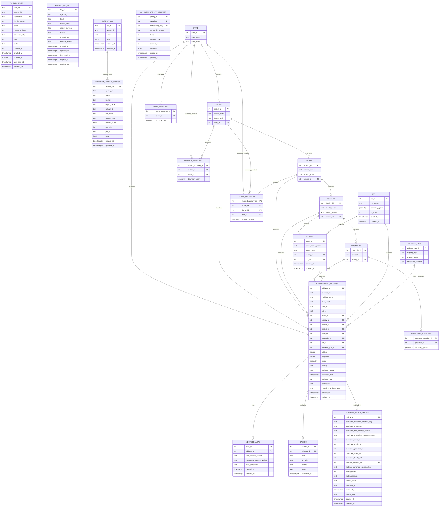

# Runtime ERD

This ERD covers the main runtime tables visible in this repo:

- ingest runtime tables from Alembic migrations
- auth/admin tables from Alembic migrations
- address-domain tables created and maintained by `etl/load/postgres.py`
- lookup hierarchy and review tables referenced by repositories and ETL

Important caveat:

- some relationships are enforced as real foreign keys in migrations
- some address-domain relationships are inferred from ETL/repository code and may not be declared as DB-level FKs in every environment

## Mermaid ERD

## Scope Notes

### Explicit FK relationships in repo migrations

These are explicitly added by migrations:

- `address_alias.address_id -> standardized_address.address_id`
- `address_match_review.matched_address_id -> standardized_address.address_id`

### Logical or inferred relationships

These are strongly implied by ETL/repository code, but may not be declared as DB FKs in every environment:

- `district.state_id -> state.state_id`
- `mukim.district_id -> district.district_id`
- `locality.mukim_id -> mukim.mukim_id`
- `postcode.locality_id -> locality.locality_id`
- `street.locality_id -> locality.locality_id`
- `street.pbt_id -> pbt.pbt_id`
- `standardized_address.*_id -> lookup/reference tables`
- `naskod.address_id -> standardized_address.address_id`
- boundary tables to their matching lookup/reference tables

Recommended FK-style boundary linkage:

- `state_boundary.state_id -> state.state_id`
- `district_boundary.district_id -> district.district_id`
- `district_boundary.state_id -> state.state_id`
- `mukim_boundary.mukim_id -> mukim.mukim_id`
- `mukim_boundary.district_id -> district.district_id`
- `mukim_boundary.state_id -> state.state_id`
- `postcode_boundary.postcode_id -> postcode.postcode_id`

This is the cleaner target relational model, even though the current ETL still partially derives postcode/admin matches from boundary source text columns before resolving to canonical lookup IDs.

### Agency scoping relationships

These are application-level, not DB FK-level:

- `agency_user.agency_id -> ingest_job.agency_id`
- `agency_api_key.agency_id -> ingest_job.agency_id`
- `agency_user.agency_id -> multipart_upload_session.agency_id`
- `agency_api_key.agency_id -> multipart_upload_session.agency_id`
- `api_idempotency_request.agency_id` is also agency-scoped

The app enforces agency visibility by filtering on `agency_id`, not by foreign-key constraints.

## Table Families

### Auth and tenancy

- `agency_user`
- `agency_api_key`
- `api_idempotency_request`

### Ingest runtime

- `ingest_job`
- `multipart_upload_session`

### Address master data

- `state`
- `district`
- `mukim`
- `locality`
- `postcode`
- `street`
- `pbt`
- `address_type`
- `standardized_address`
- `naskod`

### Match and review

- `address_alias`
- `address_match_review`

### Spatial governance

- `state_boundary`
- `district_boundary`
- `mukim_boundary`
- `postcode_boundary`

In the target model, each boundary row should belong to one canonical lookup row by FK-style ID linkage, not only by text labels such as postcode/state/district names.

## Source Basis

This ERD was derived from:

- Alembic migrations under `backend/app/db/migrations/versions/`
- ETL table creation and write logic in `etl/load/postgres.py`
- repository joins in:
  - `backend/app/repositories/address_read_repository.py`
  - `backend/app/repositories/address_match_review_repository.py`
  - `backend/app/repositories/lookup_admin_repository.py`
